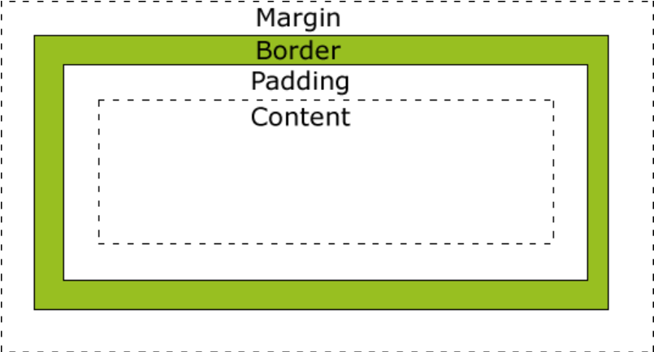

This project is aiming to rebuilt omofun.So frome today i will do not continue to make game by C program.Instand i will learn one new thing :java.  
# Day1:
Before java i have to know css and html. 
# Day2:
I have learn html.It is more easier than C program.Today i learn css.The two have many things similar.So i will finish it in three days.  
The most in important things i learn is `<style></style>`  
# DAY3:
I download Andriod Studio.Use it to motify a phone powerd by andriod .So i spend half of one day learning css.Still there are many things similar.Just like repeat.About the `<style></style>`,`<a></a>`is different frome others.<br>
About a:
``` a.one:link{color: black;text-decoration: none;}
        a.one:visited{color: rgb(44, 81, 184);text-decoration: none;}
        a.one:hover{color: blueviolet;text-decoration: underline;}
```
Others:
```body{background-image: url(run.jpg);}
        p.normal{font-style:normal;} 
        p.italic{font-style:italic;} 
        p.big{font-size: 40px;}
        p.small{font-size: 10px;}
        p.bold{font-weight: bold;}
        p.light{font-weight: lighter;}
```
# Day4:
 
This is box ilearn today.

# Day5:
this [website](https://www.runoob.com/css/css-positioning.html) runoob is freidly to me.
# Day6:
Learned imge about flaot and something simple.Tomorrow i will have a text :C1.But i still spend time on this.I think the process is too slow.I will go to school ,i do not know if i will spend more time on the web.But i have nothing to do from my last term.In fact i am willing to learn <a href="https://www.runoob.com/css/css-navbar.html" target="_blank">this</a> tomorrow i will learn
# Day7:
Today I have a lot of thing to do like the exam for c1 and my homework accessing next term.
